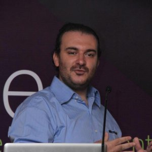
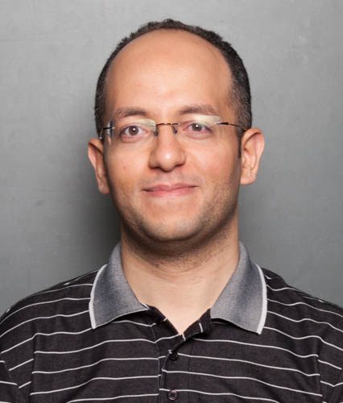

Podcast for Egyptian and Arabic-speaking developers

# Hosts

    

        
        
Mohamed Elsherif

    

    

        
        
Yasser Makram

    

    

        
        
Amr Eldib

    

Listen to [all podcasts episodes](https://soundcloud.com/askdeveloper).  
Subscribe to our [Facebook page](https://www.facebook.com/askdeveloper/).  
Follow us on [SoundCloud](https://soundcloud.com/askdeveloper/sets/askdeveloper), [iTunes](https://itunes.apple.com/us/podcast/ask-developer-podcast/id627390638), or [Stitcher](http://www.stitcher.com/podcast/ask-developer-podcast).  
You can watch all podcasts and hangouts on our [YouTube channel](https://www.youtube.com/user/bashmohandes) or in this [playlist](https://www.youtube.com/playlist?list=PLJYBTsbldfv8tWX-KJMMmCO313pBXKL4l).  

